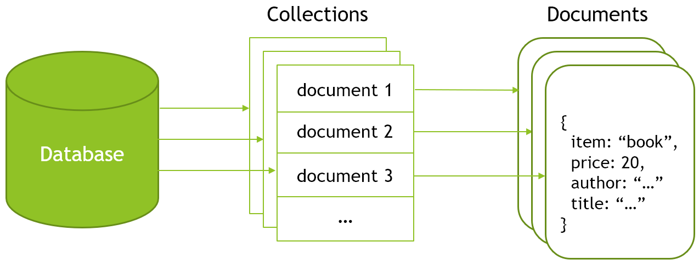

# MongoDB
MongoDB uses a unique set of commands and queries because it’s a `NoSQL` database that organizes data in a `document`-oriented (rather than relational) structure. In MongoDB, data is stored in JSON-like documents within collections rather than in rows and tables as in SQL databases.

Cd mongodb-macos-aarch64-7.0.5
mogosh 
show dbs
//COLLECTIONS IN MONGODB
show collections
db.createCollection("users2" ) //creates collection
db.createCollection("logs", { capped: true, size: 1000000 }) //capped collecion
db.createCollection("logs", { capped: true, size: 1000000 })
db.getCollectionNames().length //gives count of collections
db.users.insertOne({ name: "Alice", age: 30 }) //creates a collection and adds data in it
db.users.insertMany([
  { name: "Bob", age: 25 },
  {name : "akash12" , age :26},
 { name: "akash23", age: 35 },
   { name: "akash28", age: 34 }
])
db.users.updateOne({ name : 'Akash' } , {$set :{ name: 'Akash22' }}); // updates name field
db.users.updateOne({ name: "Akash" }, { $set: { age: 31 } }) // updates name fields age to 31
db.collection_name.deleteOne({ key: value }) //delete a key
db.users.deleteOne({ name: "Bob" })
db.users.count() //Use count to count the number of documents in a collection.
db.dropDatabase() 
db.collection_name.drop()
db.users.find() //finds all data in users collection 
db.users.find({ age: { $gt: 30 } })
db.users.createIndex({ name: 1 }) // 1 for ascending index, -1 for descending
db.users.count({ age: { $gt: 30 } })
db.users.find().sort({ age: -1 }) //sorting wrt age in decreasing order
db.users.find({ $text: { $search: "ak" } })